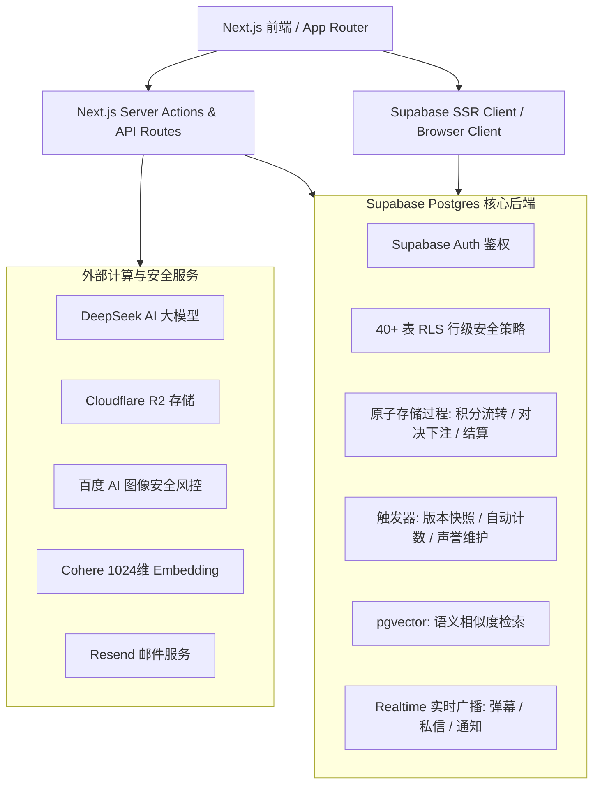

# 🎓 Scholarly - 现代化全栈学术交流与知识竞技论坛

<p align="center">
  
  
  
  
  
  
</p>

<p align="center">
  <a href="README.md">简体中文</a> | <a href="README_EN.md">English</a>
</p>

<p align="center">
  <b>Scholarly</b> 是一个专为学者、研究人员及高校学生打造的高性能、学术友好型全栈论坛系统。<br />
  融合了 <b>LaTeX 实时渲染</b>、<b>学术版本修订对比</b>、<b>实时学术对决 (Duels)</b>、<b>1024 维向量知识网络</b>、<b>同行评审</b>、<b>实验室共创</b> 以及 <b>代币与 VIP 激励体系</b>。
</p>

<p align="center">
  🔗 <b>线上体验地址</b>: <a href="https://scholarly.wiki">https://scholarly.wiki</a>
</p>

---

## 📸 系统架构概览

本项目采用 **Next.js 15 (App Router / BFF) + Supabase (PostgreSQL 15 BaaS)** 双后端驱动架构：



---

## ✨ 核心特性矩阵（100% 基于仓库实现）

### 1. 📝 专业学术内容生产与版本管理
- **深度定制富文本编辑器**：基于 Novel 与 Tiptap，原生支持 **LaTeX 数学公式**（行内 `$...$` 与独立公式块 `$$...$$`）、**Lowlight 代码高亮**、**Mermaid 流程/时序图** 以及 **WikiLink 站内双向关联**。
- **学术版本控制与修订对比 (Revisions Diff)**：每次编辑自动保存历史快照版本，支持可视化差异对比，确保学术演进过程透明严谨。
- **学术元数据与文献导出**：内置 DOI、期刊名、引用格式管理，支持一键生成规范的 **BibTeX 引用代码** 与 **学术排版 PDF 导出**。
- **问答与采纳机制 (Accepted Answer)**：提问者可一键采纳最佳解决方案，并自动为回答学者增加学术声誉值。

### 2. ⚔️ 学术对决与辩论竞技场 (Academic Duels)
- **多轮辩论与实时交锋**：支持发起指定或公开的学术对决，支持双方多轮发言、AI 阶段性辅助分析与观众 **Realtime 弹幕** 互动。
- **LP 保证金质押与观众预测下注 (Bets)**：对决双方质押保证金，观众可参与预测押注；比赛结束后通过 Postgres 原子事务自动执行 **1:2 奖池清算分账**。
- **同行评审 (Peer Review)**：引入学术同行打分（严谨度、原创性、清晰度三维评审），形成公正的学术仲裁体系。

### 3. 🔬 协作研讨实验室 (Collaborative Lab)
- **研讨房间管理**：支持创建文献研讨室 (Reading)、白板协作 (Whiteboard) 与混合 (Hybrid) 研讨室。
- **实时笔记快照 (Yjs)**：基于 Yjs 二进制状态快照，提供定时自动备份、手动打标快照与一键回滚。
- **共创发帖机制**：支持多位学者联合发布共创文章，自动记录 **Co-author / Contributor** 贡献者角色。

### 4. 🔍 知识图谱与 1024 维语义向量检索
- **多语言学术 Embedding**：集成 Cohere 1024 维多语言向量模型。
- **pgvector 向量相似度推荐**：利用余弦距离索引，在文章底部自动生成“相关学术研究”与“语义关联网络”。

### 5. 💎 代币激励、VIP 等级与声誉系统
- **原子积分经济体系 (Credits)**：内置积分流水记账（入驻礼包、月度研讨津贴、对决质押/奖金、AI 使用扣费等），使用 `FOR UPDATE` 行锁保证并发安全。
- **VIP 5 级荣誉特权**：从“初级学者”到“终身院士”，动态计算声誉值与活跃度，解锁专属徽章、个性化头衔与主页横幅样式。
- **多维度学术排行榜**：提供周点赞榜、周收藏榜、贡献值榜及声誉榜。

### 6. 💬 实时社交与私信通讯
- **Supabase Realtime 私信**：支持双向即时聊天、帖子引用卡片、2 分钟内消息撤回以及附件安全下载。
- **全站通知中枢**：涵盖好友申请、决斗邀请、评论互动、系统公告等多维度通知。

### 7. 🛡️ 工业级双重风控与管理员控制台 (Admin Console)
- **双重内容安全防护**：
  - 本地敏感词规则库自动拦截与转审；
  - 百度 AI 图像安全风控引擎，自动审查头像与附件。
- **4 级管理员 RBAC 体系**（`super_admin`, `admin`, `moderator`, `analyst`）：
  - 违规学者封禁/禁言；
  - 违规帖子与评论下架/锁定；
  - 全站系统公告发布；
  - 积分批量定向/全员发放；
  - 邀请码生成与授权管理；
  - 敏感操作全程审计日志。
- **40+ 细粒度 Postgres RLS 策略**：数据权限层层隔离，严防越权与数据泄露。

---

## 🛠️ 技术栈全景

| 层次 | 技术选型 | 用途说明 |
| :--- | :--- | :--- |
| **前端框架** | Next.js 15 (App Router), React 19, TypeScript 5 | 核心全栈框架、服务端组件 (RSC) 与 Server Actions |
| **样式与组件** | Tailwind CSS v4, Shadcn/UI (Radix UI), Framer Motion | 现代化响应式设计、设计系统与流畅微交互 |
| **BaaS & 数据** | Supabase (PostgreSQL 15+, Auth, Realtime, Storage) | 用户认证、行级安全 (RLS)、RPC 存储过程与实时推送 |
| **向量引擎** | pgvector (1024 维), Cohere Multilingual Embeddings | 学术文献与帖子的语义相似度关联推荐 |
| **富文本体系** | Novel, Tiptap 2.27, KaTeX, Lowlight, Mermaid | LaTeX 公式、代码高亮、图表、WikiLink 双向链接 |
| **AI 大模型** | Vercel AI SDK (`@ai-sdk/deepseek`, `ai`), DeepSeek | 智能文献润色、辩论分析与同行评审 |
| **对象存储** | Cloudflare R2 / Supabase Storage | 附件、学术图表、文集封面、用户头像存储 |
| **邮件服务** | Resend | 验证邮件、举报反馈与系统通知 |

---

## 🚀 快速启动指南

### 1. 克隆项目与安装依赖

```bash
# 克隆代码库
git clone https://github.com/Cry4me1/Academic-Exchange-Forum.

# 进入项目目录
cd Academic-Exchange-Forum

# 安装依赖
npm install
```

### 2. 配置环境变量

在项目根目录下创建 `.env.local` 文件，填入所需的环境变量配置（**请替换为你自己的服务密钥，切勿将敏感密钥提交到公开仓库**）：

```env
# ==============================================================================
# 1. Supabase 核心配置 (必需)
# 获取地址: https://supabase.com/dashboard/project/_/settings/api
# ==============================================================================
NEXT_PUBLIC_SUPABASE_URL=https://your-project.supabase.co
NEXT_PUBLIC_SUPABASE_ANON_KEY=your_supabase_anon_key
SUPABASE_SERVICE_ROLE_KEY=your_supabase_service_role_key

# ==============================================================================
# 2. 邮件服务 (Resend - 用于系统通知与邮件验证)
# 获取地址: https://resend.com/api-keys
# ==============================================================================
RESEND_API_KEY=re_your_resend_api_key

# ==============================================================================
# 3. AI 大模型集成 (DeepSeek / Vercel AI SDK)
# ==============================================================================
DEEPSEEK_API_KEY=your_deepseek_api_key

# ==============================================================================
# 4. 学术向量语义检索 (Cohere 1024维模型)
# 获取地址: https://dashboard.cohere.com/api-keys
# ==============================================================================
EMBEDDING_API_URL=https://api.cohere.com/v1/embed
EMBEDDING_API_KEY=your_cohere_api_key
EMBEDDING_MODEL=embed-multilingual-v3.0

# ==============================================================================
# 5. 对象存储 (Cloudflare R2 - 用于图片与大文件附件)
# ==============================================================================
R2_ACCOUNT_ID=your_cloudflare_account_id
R2_ACCESS_KEY_ID=your_r2_access_key_id
R2_SECRET_ACCESS_KEY=your_r2_secret_access_key
R2_BUCKET_NAME=scholarly-images
R2_PUBLIC_URL=https://pub-your-bucket-id.r2.dev

# ==============================================================================
# 6. 图像安全风控 (百度 AI 图像审核 - 可选)
# ==============================================================================
BAIDU_IMAGE_CENSOR_API_KEY=your_baidu_censor_api_key
BAIDU_IMAGE_CENSOR_SECRET_KEY=your_baidu_censor_secret_key
```

---

### 3. 数据库初始化 (重要！)

> [!IMPORTANT]
> 本项目的全部核心业务逻辑（用户 Profile 触发器、40+ 行级安全策略 RLS、积分事务扣减、对决下注与清算、1024 维向量索引等）均位于 Postgres 数据库层。**在首次运行前，必须执行数据库初始化！**

我们提供了 **两种极简初始化方案**：

#### 方案 A：Supabase SQL Editor 一键初始化（推荐，只需 10 秒）
1. 登录你的 [Supabase 控制台](https://supabase.com/dashboard)；
2. 进入左侧菜单 **SQL Editor** -> 点击 **New query**；
3. 打开本项目中的 [`supabase/schema.sql`](supabase/schema.sql) 文件，复制全部内容；
4. 粘贴到 SQL Editor 中并点击 **Run** 即可完成全部 46 张表、29 个 RPC 存储过程、触发器与 RLS 策略的初始化！

#### 方案 B：使用 Supabase CLI 命令行同步
```bash
# 关联到你的 Supabase 项目
npx supabase link --project-ref <your-supabase-project-ref>

# 推送并执行迁移
npx supabase db push
```

---

### 4. 初始化超级管理员 (Super Admin)

由于数据库剥离了个人硬编码，新部署环境注册的第一个用户默认为普通学者。如需解锁**管理后台 (`/admin`)** 与全站最高管理权限，请在注册好账号后，在 Supabase **SQL Editor** 中执行以下指令（**将 `'your_username'` 替换为你注册的实际用户名**）：

```sql
-- 1. 赋予 super_admin 超级管理员权限（可进入管理后台并管理全站角色）
INSERT INTO public.admin_roles (user_id, role)
SELECT id, 'super_admin' 
FROM public.profiles 
WHERE username = 'your_username'
ON CONFLICT (user_id, role) DO NOTHING;

-- 2. 赋予开发者专属标识与头衔
UPDATE public.profiles 
SET 
  is_developer = TRUE,
  developer_title = '系统架构师',
  reputation_score = 99999
WHERE username = 'your_username';
```

---

### 5. 运行本地开发服务器

```bash
npm run dev
```

打开浏览器访问 [http://localhost:3000](http://localhost:3000)，即可进入 **Scholarly 学术论坛**！

---

## 📂 项目结构概览

```
academic_forum/
├── src/
│   ├── app/
│   │   ├── (admin)/             # 4 级权限管理后台 (仪表盘/用户/帖子/举报/公告/积分/对决/日志)
│   │   ├── (auth)/              # 认证体系 (登录/注册/找回密码/重置密码)
│   │   ├── (protected)/         # 核心业务保护路由
│   │   │   ├── dashboard/       # 学者动态流
│   │   │   ├── duels/           # 学术对决辩论场与预测押注
│   │   │   ├── lab/             # 协作研讨实验室与 Yjs 笔记
│   │   │   ├── collections/     # 学术文集与合集
│   │   │   ├── leaderboard/     # 社区排行榜
│   │   │   ├── messages/        # Realtime 私信与附件
│   │   │   ├── vip/             # VIP 荣誉与权益体系
│   │   │   └── settings/        # 个人设置与第三方绑定
│   │   ├── api/                 # 后端 API 路由 (AI 润色/上传/向量化/洛谷验证/风控)
│   │   ├── posts/               # 公开帖子详情、LaTeX 渲染与 BibTeX 导出
│   │   └── layout.tsx           # 全局根布局与主题 Providers
│   ├── components/              # 模块化 UI 组件
│   │   ├── editor/              # Novel/Tiptap 富文本编辑器、LaTeX 与 AI 扩展
│   │   ├── duel/                # 对决辩论、弹幕与押注组件
│   │   ├── lab/                 # 实验室协作与白板组件
│   │   ├── chat/                # 私信对话与附件组件
│   │   └── ui/                  # 基于 Shadcn/UI 的原子设计组件
│   ├── lib/                     # Supabase SSR/Admin 客户端、权限中间件、工具函数
│   └── types/                   # 全局 TypeScript 类型定义
├── supabase/
│   ├── schema.sql               # ⭐️ 归一化纯净全量数据库架构脚本 (一键初始化)
│   └── migrations/              # 历史增量迁移记录
└── public/                      # 静态资源与字体
```

---

## 📜 常用命令

| 命令 | 说明 |
| :--- | :--- |
| `npm run dev` | 启动本地 Next.js 开发服务器 (`http://localhost:3000`) |
| `npm run build` | 执行 TypeScript 校验并构建生产包 |
| `npm run start` | 启动生产环境服务 |
| `npm run lint` | 运行 ESLint 代码规范扫描 |

---

## 🤝 贡献与开发规范

1. **类型安全**：始终编写严格的 TypeScript 代码，避免使用 `any`。
2. **界面规范**：遵循极简学术风格，默认使用 Tailwind CSS v4 与 Shadcn/UI，界面文字以**中文**为准。
3. **数据库变更**：涉及到数据表、RPC 或安全规则修改时，请同步更新 `supabase/schema.sql` 并验证 RLS 行级策略。

---

## 📄 开源协议

本项目基于 [MIT License](LICENSE) 协议开源。
