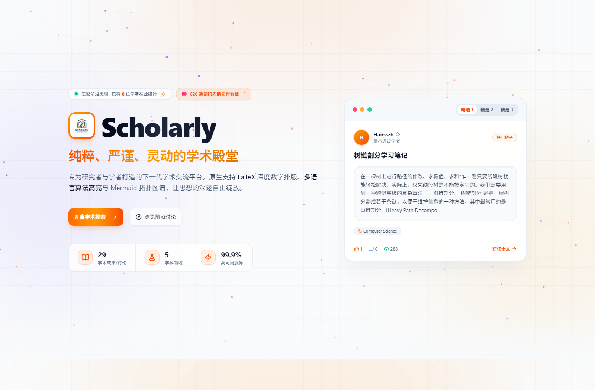
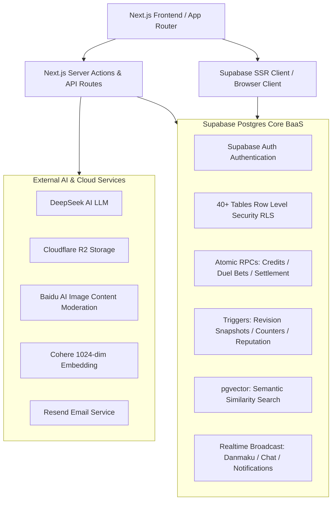
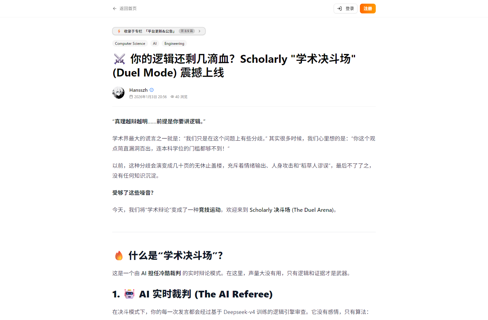
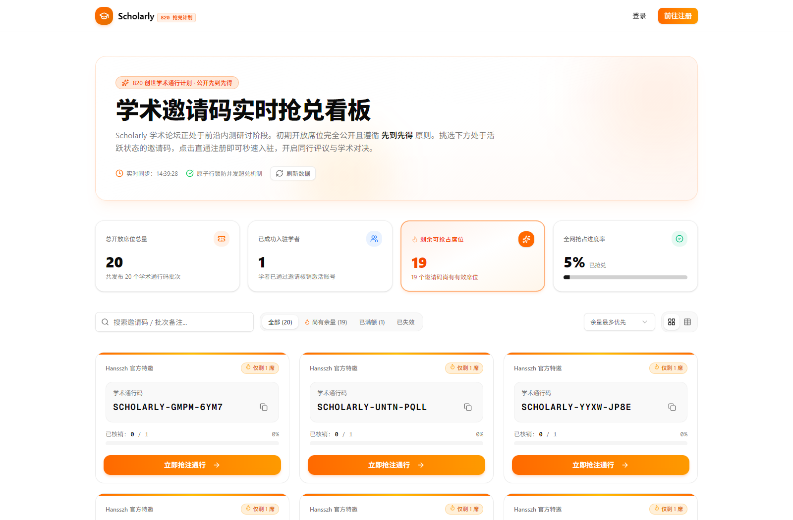
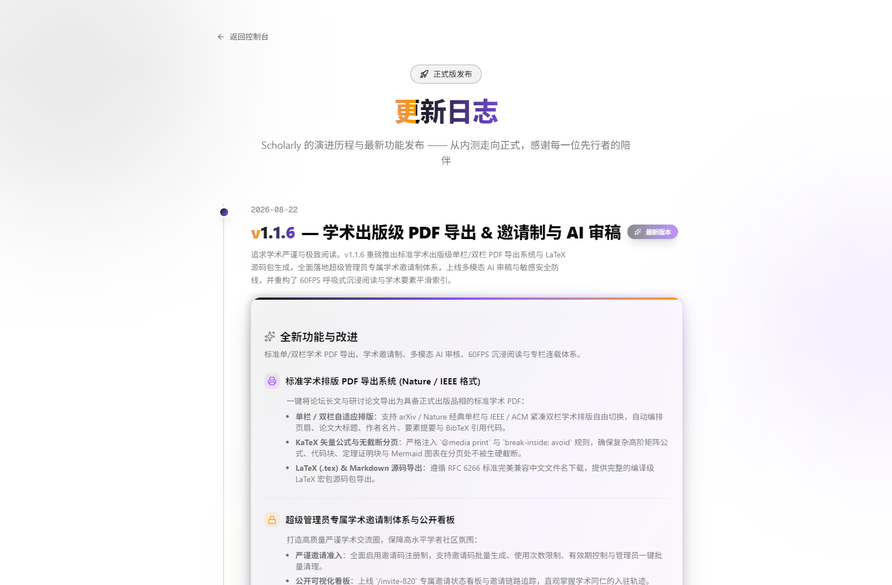

# 🎓 Scholarly - Modern Full-Stack Academic Forum & Knowledge Arena

<p align="center">
  
  
  
  
  
  
</p>

<p align="center">
  <a href="README.md">简体中文</a> | <a href="README_EN.md">English</a>
</p>

<p align="center">
  <b>Scholarly</b> is a high-performance, academic-friendly full-stack forum and collaborative arena tailored for researchers, scholars, and university students.<br />
  Featuring <b>real-time LaTeX rendering</b>, <b>academic revision diffs</b>, <b>real-time Academic Duels</b>, <b>1024-dimensional vector knowledge network</b>, <b>peer review system</b>, <b>collaborative research labs</b>, and a <b>credit & VIP reputation economy</b>.
</p>

<p align="center">
  🔗 <b>Live Demo</b>: <a href="https://scholarly.wiki">https://scholarly.wiki</a>
</p>

<p align="center">
  
</p>

---

## 📸 System Architecture

This project is built on a **Next.js 15 (App Router / BFF) + Supabase (PostgreSQL 15 BaaS)** dual-engine backend architecture:



---

## ✨ Core Feature Matrix (100% Implemented in Codebase)

### 1. 📝 Academic Content Production & Version Control
- **Customized Rich Text Editor**: Powered by Novel & Tiptap, natively supporting inline `$...$` and display `$$...$$` **LaTeX formulas**, **Lowlight code syntax highlighting**, **Mermaid diagrams**, and **WikiLink bidirectional links**.
- **Revision History & Visual Diff**: Automatically creates historical revision snapshots on every update, supporting side-by-side visual diff comparison.
- **Academic Metadata & Export**: Built-in DOI, journal name, and citation metadata management, supporting one-click **BibTeX citations** and **Nature / IEEE academic formatted PDF export**.
- **Accepted Answer System**: Post authors can mark the accepted solution, awarding academic reputation scores to contributors.

<p align="center">
  
</p>

### 2. ⚔️ Academic Duels & Debate Arena
- **Multi-Round Debate & Realtime Interaction**: Initiate open or targeted academic debates with multi-round rebuttal speeches, AI stage-by-stage debate analysis, and **Realtime spectator Danmaku** (bullet comments).
- **LP Staking & Prediction Bets**: Debaters stake LP guarantees, and spectators can place prediction bets. After resolution, a Postgres atomic transaction automatically distributes **1:2 pool payouts**.
- **Peer Review Mechanism**: Community peer reviews with 3-dimensional ratings (Academic Rigor, Originality, and Clarity).

### 3. 🔬 Collaborative Research Lab
- **Research Room Management**: Create dedicated rooms for Literature Reading (Reading), Whiteboard (Whiteboard), or Hybrid modes.
- **Realtime Document Snapshots (Yjs)**: Binary Yjs document snapshots with auto-save timers, manual labeled snapshots, and one-click rollback.
- **Co-Author Publishing**: Jointly publish papers and articles from lab rooms with explicit **Co-author / Contributor / Annotator** role attribution.

### 4. 🔍 Knowledge Graph & 1024-dim Vector Semantic Search
- **Multilingual Academic Embeddings**: Integrated with Cohere 1024-dimensional multilingual embedding models.
- **pgvector Cosine Similarity Recommendations**: Automatically discovers and displays related academic research and citation graphs based on semantic proximity.

### 5. 💎 Tokenomics, VIP Tiers & Reputation System
- **Atomic Credit Economy**: Full transaction accounting (welcome bonuses, monthly research stipends, duel stakes/rewards, AI generation fees), guaranteed with `FOR UPDATE` row-level locks.
- **VIP 5-Tier Honors**: Progressing from "Junior Scholar" to "Academician", unlocking custom honors, badges, and profile banner styles.
- **Objective Community Leaderboards**: Weekly upvotes, bookmarks, contribution count, and reputation leaderboards with natural rank sorting.

### 6. 💬 Real-Time Messaging & Social Network
- **Supabase Realtime Direct Messaging**: Fast dual-way chat, referenced post cards, 2-minute message revocation, and secure attachment downloads.
- **Global Notification Center**: Centralized alerts for friendship requests, duel invites, comments, mentions, and system broadcasts.

### 7. 🛡️ Dual-Layer Moderation & 4-Tier Admin Console
- **Comprehensive Content Safety**:
  - Local sensitive keyword dictionary with auto-block and pending queue routing;
  - Baidu AI visual content moderation engine for avatars and attachments.
- **4-Tier RBAC Admin Console** (`super_admin`, `admin`, `moderator`, `analyst`):
  - User ban & mute controls;
  - Post & comment takedown/locking;
  - Broadcast system announcements;
  - Batch credit grants (targeted or global);
  - Invitation code generation & usage tracking;
  - Full audit logging of administrative actions.
- **40+ Granular PostgreSQL RLS Policies**: Strict multi-tenant data isolation and anti-privilege escalation.

<p align="center">
  
</p>

<p align="center">
  
</p>

---

## 🛠️ Tech Stack

| Layer | Technology | Purpose |
| :--- | :--- | :--- |
| **Framework** | Next.js 15 (App Router), React 19, TypeScript 5 | Server Components (RSC), Server Actions, and BFF routing |
| **Styling & UI** | Tailwind CSS v4, Shadcn/UI (Radix UI), Framer Motion | Modern responsive UI design, atomic component system |
| **BaaS & DB** | Supabase (PostgreSQL 15+, Auth, Realtime, Storage) | Authentication, Row Level Security (RLS), and database RPCs |
| **Vector Engine**| pgvector (1024-dim), Cohere Multilingual Embeddings | Semantic search and contextual paper recommendations |
| **Rich Text** | Novel, Tiptap 2.27, KaTeX, Lowlight, Mermaid | LaTeX formulas, syntax highlighting, and WikiLink graphs |
| **AI Integration**| Vercel AI SDK (`@ai-sdk/deepseek`, `ai`), DeepSeek | AI literature refinement, duel analysis, and peer reviews |
| **Storage** | Cloudflare R2 / Supabase Storage | Attachments, diagrams, covers, and avatars |
| **Email** | Resend | Verification emails, report triage, and notifications |

---

## 🚀 Quick Start Guide

### 1. Clone the Repository & Install Dependencies

```bash
# Clone the repository
git clone https://github.com/Cry4me1/Academic-Exchange-Forum.

# Enter project directory
cd Academic-Exchange-Forum

# Install dependencies
npm install
```

### 2. Configure Environment Variables

Create a `.env.local` file in the project root and fill in the required credentials:

```env
# ==============================================================================
# 1. Supabase Core Config (Required)
# Get from: https://supabase.com/dashboard/project/_/settings/api
# ==============================================================================
NEXT_PUBLIC_SUPABASE_URL=https://your-project.supabase.co
NEXT_PUBLIC_SUPABASE_ANON_KEY=your_supabase_anon_key
SUPABASE_SERVICE_ROLE_KEY=your_supabase_service_role_key

# ==============================================================================
# 2. Email Service (Resend - for notifications & verification)
# Get from: https://resend.com/api-keys
# ==============================================================================
RESEND_API_KEY=re_your_resend_api_key

# ==============================================================================
# 3. AI LLM Integration (DeepSeek / Vercel AI SDK)
# ==============================================================================
DEEPSEEK_API_KEY=your_deepseek_api_key

# ==============================================================================
# 4. Academic Vector Search (Cohere 1024-dim Model)
# Get from: https://dashboard.cohere.com/api-keys
# ==============================================================================
EMBEDDING_API_URL=https://api.cohere.com/v1/embed
EMBEDDING_API_KEY=your_cohere_api_key
EMBEDDING_MODEL=embed-multilingual-v3.0

# ==============================================================================
# 5. Object Storage (Cloudflare R2 - for images & large attachments)
# ==============================================================================
R2_ACCOUNT_ID=your_cloudflare_account_id
R2_ACCESS_KEY_ID=your_r2_access_key_id
R2_SECRET_ACCESS_KEY=your_r2_secret_access_key
R2_BUCKET_NAME=scholarly-images
R2_PUBLIC_URL=https://pub-your-bucket-id.r2.dev

# ==============================================================================
# 6. Image Safety Moderation (Baidu AI Image Censor - Optional)
# ==============================================================================
BAIDU_IMAGE_CENSOR_API_KEY=your_baidu_censor_api_key
BAIDU_IMAGE_CENSOR_SECRET_KEY=your_baidu_censor_secret_key
```

---

### 3. Database Initialization (Important!)

> [!IMPORTANT]
> All core business logic (user profile triggers, 40+ RLS security policies, credit accounting, duel bet settlements, and 1024-dim vector indexes) resides in the Postgres database layer. **You must initialize the database before running the project!**

We provide **two simple initialization methods**:

#### Option A: Supabase SQL Editor (Recommended, 10 seconds)
1. Go to your [Supabase Dashboard](https://supabase.com/dashboard);
2. Navigate to **SQL Editor** -> Click **New query**;
3. Copy the entire content of [`supabase/schema.sql`](supabase/schema.sql);
4. Paste it into the SQL Editor and click **Run** to set up all 46 tables, 29 RPC functions, triggers, and RLS policies!

#### Option B: Supabase CLI
```bash
# Link to your Supabase project
npx supabase link --project-ref <your-supabase-project-ref>

# Push database schema
npx supabase db push
```

---

### 4. Initialize Super Admin

Because all personal hardcoding has been removed, the first registered user is a standard scholar by default. To grant **Super Admin (`/admin`)** access, run the following query in your Supabase **SQL Editor** after signing up (replace `'your_username'` with your registered username):

```sql
-- 1. Grant super_admin RBAC role
INSERT INTO public.admin_roles (user_id, role)
SELECT id, 'super_admin' 
FROM public.profiles 
WHERE username = 'your_username'
ON CONFLICT (user_id, role) DO NOTHING;

-- 2. Grant Developer title and badge
UPDATE public.profiles 
SET 
  is_developer = TRUE,
  developer_title = 'System Architect',
  reputation_score = 99999
WHERE username = 'your_username';
```

---

### 5. Start Development Server

```bash
npm run dev
```

Open your browser at [http://localhost:3000](http://localhost:3000) to start exploring **Scholarly**!

---

## 📂 Project Structure

```
academic_forum/
├── src/
│   ├── app/
│   │   ├── (admin)/             # 4-tier admin console (dashboard/users/posts/reports/credits/duels)
│   │   ├── (auth)/              # Authentication (login/register/forgot-password/reset-password)
│   │   ├── (protected)/         # Core protected routes
│   │   │   ├── dashboard/       # Scholar feed
│   │   │   ├── duels/           # Academic debate arena & prediction betting
│   │   │   ├── lab/             # Research labs & Yjs collaborative notes
│   │   │   ├── collections/     # Academic collections & series
│   │   │   ├── leaderboard/     # Community leaderboards
│   │   │   ├── messages/        # Realtime chat & attachments
│   │   │   ├── vip/             # VIP honor & privilege tier system
│   │   │   └── settings/        # Profile settings & linked accounts
│   │   ├── api/                 # Backend API routes (AI/upload/embed/luogu/moderation)
│   │   ├── posts/               # Public post views, LaTeX rendering & BibTeX export
│   │   └── layout.tsx           # Global root layout & theme providers
│   ├── components/              # Modular UI components
│   │   ├── editor/              # Novel/Tiptap editor, LaTeX & AI extensions
│   │   ├── duel/                # Debate, Danmaku & betting components
│   │   ├── lab/                 # Collaborative lab & whiteboard components
│   │   ├── chat/                # Direct messaging & attachment components
│   │   └── ui/                  # Shadcn/UI atomic design components
│   ├── lib/                     # Supabase SSR/Admin clients, permissions, utilities
│   └── types/                   # Global TypeScript type definitions
├── supabase/
│   ├── schema.sql               # ⭐️ Clean, unified full database schema (One-click init)
│   └── migrations/              # Historical incremental migrations
└── public/                      # Static assets and fonts
```

---

## 📜 Available Scripts

| Command | Description |
| :--- | :--- |
| `npm run dev` | Starts local Next.js dev server at `http://localhost:3000` |
| `npm run build` | Runs TypeScript checks and compiles production build |
| `npm run start` | Starts production server |
| `npm run lint` | Runs ESLint code style scan |

---

## 🤝 Contribution Guidelines

1. **Type Safety**: Always write strictly typed TypeScript code without `any`.
2. **Design Consistency**: Follow minimalist academic UI styling with Tailwind CSS v4 and Shadcn/UI.
3. **Database Changes**: Update `supabase/schema.sql` and verify RLS policies whenever modifying schema or RPCs.

---

## 📄 License

This project is open-sourced under the [MIT License](LICENSE).
